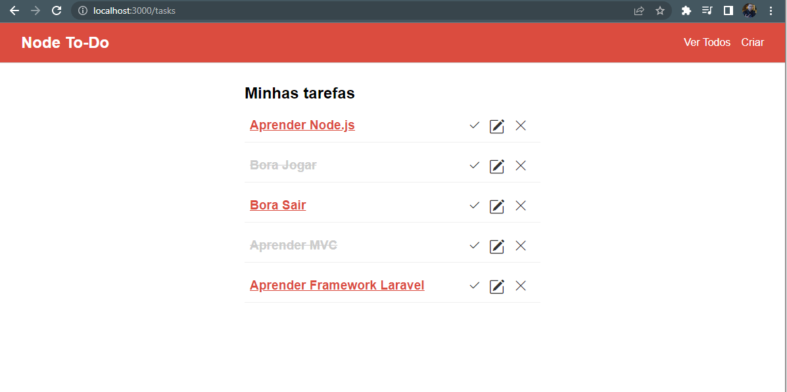
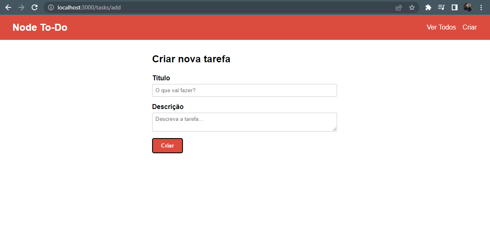
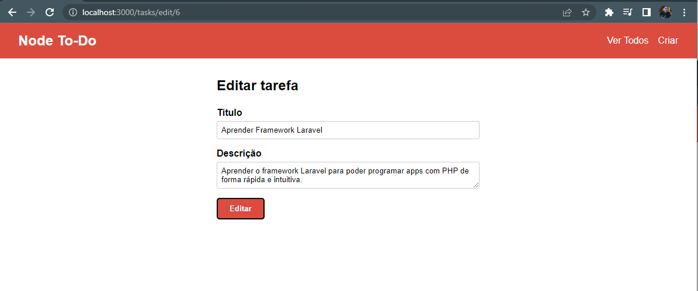

# Projeto de Lista To-Do em Node.js

Controle suas tarefas de forma simples e rápida.

## :mag_right:Sobre o projeto
Projeto simples feito durante o curso de Node.js com o objetivo de criar uma lista de tarefas (To do List). Utilizada a arquitetura MVC para organizar o projeto de forma simples e intuitiva.

## :art: Layout
### Homepage

### Adicionar tarefa

### Editar tarefa

## :gear: Tecnologias/Ferramentas utilizadas
- [HTML5](https://developer.mozilla.org/pt-BR/docs/Web/HTML)
- [CSS](https://developer.mozilla.org/pt-BR/docs/Web/CSS)
- [Javascript](https://developer.mozilla.org/pt-BR/docs/Web/JavaScript)
- [Node.js](https://nodejs.org/en/)
- [Express and Express Handlebars](https://www.npmjs.com/package/express-handlebars)
- [Sequelize ORM](https://sequelize.org/)
- [XAMP - Mysql](https://www.apachefriends.org/pt_br/index.html)

## :file_folder: Como executar o projeto

Requisitos: 
- node instalado na máquina
- git instalado na máquina
 
### Criar uma pasta para o projeto
No terminal, no local onde deseja criar uma pasta execute o comando: 
mkdir <nome_da_pasta>
### Clonar repositório
git clone https://github.com/DioneDw/node-to-do.git
### Instalar o node modules e dependências na pasta principal
npm install                                                                                                          
### Iniciar o servidor node (dentro da pasta principal. Executar):            
npm start

Abrir a url localhost no navegador de sua preferencia.

## :raising_hand_man: Autor
Dione Willy Evangelista
https://www.linkedin.com/in/dione-willy-evangelista-59ab8314a/